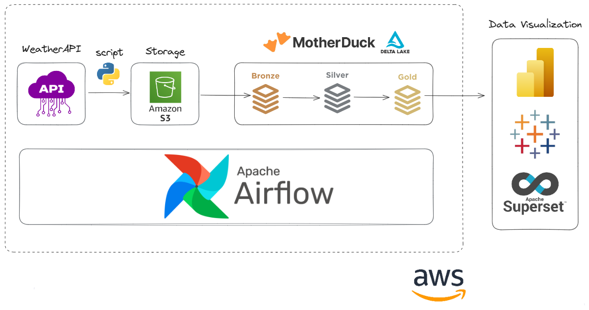

# Data Lakehouse with Weather Data

## Overview
This project is a data engineering portfolio showcasing the development of a data lakehouse architecture using modern technologies. The pipeline collects weather data from an external API and processes it through a robust data workflow that leverages Apache Airflow, DBT, Motherduck and AWS services.

The objective is to demonstrate best practices in data pipeline orchestration, data modeling, and analytics while maintaining a scalable and reliable infrastructure.

## Architecture
The project employs the following architecture:

1. **Data Ingestion Layer:**
   - Data is collected from the WeatherAPI using an Airflow DAG and stored in JSON format in an S3 bucket, also keeping history files.

2. **Bronze Layer:**
   - Stores raw weather data in Delta format.

3. **Silver Layer:**
   - Processes and cleanses the raw data into structured fact and dimension tables.

4. **Gold Layer:**
   - Uses refined data from silver in order to deliver valuable information about data.

5. **Analytics Layer:**
   - Enables analytical queries and dashboards for insights.

## Key Technologies
- **Airflow:** Orchestrates data pipelines
- **DBT with DuckDB:** Handles data transformation and modeling
- **AWS EC2:** Hosts the Airflow instance
- **Docker:** Containerizes the Airflow environment
- **S3:** Data storage
- **WeatherAPI:** Source of weather data
- **Motherduck:** Provides data analytics possibilities
- **GitHub Actions:** Manages CI/CD pipeline
- **Delta Lake:** Provides structured data storage

## DAGs

### `pipeline_weather_data.py`
This DAG is responsible for:
- Fetching data from the WeatherAPI
- Saving raw JSON data to an S3 bucket in Delta format

### `pipeline_dbt.py`
This DAG orchestrates the execution of DBT models:
- Processes raw data in the Bronze layer
- Transforms and materializes tables in the Silver layer

## Data Models

### Bronze Layer
#### `landing_weather_data.sql`
- Materialized as a view
- Reads raw weather data from S3
- Filters data from the last four days

#### `incremental_weather_data.sql`
- Materialized as an incremental model
- References `landing_weather_data`
- Appends new data based on `last_updated` timestamp

### Silver Layer
#### `fact_weather_data.sql`
- Materialized as a table
- Stores fact data for weather events

#### `dimension_locations.sql`
- Materialized as a table
- Stores descriptive information about weather locations

## MotherDuck Overview

MotherDuck provides a very interesting interface for querying and analytics notebooks.

## CI/CD Pipeline
The project integrates GitHub Actions to automate the deployment process to AWS:
1. Code pushed to the main branch triggers a workflow.
2. The workflow pushes updated DAGs and DBT models to the AWS EC2 instance.
3. Airflow and DBT models are refreshed for the latest changes.

## Improvements and Future Work
- Enhance data validation and monitoring
- Implement data quality tests in DBT
- Expand analytics layer with dashboards and metrics
- Integrate additional data sources for enriched insights
